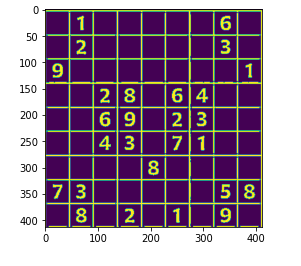
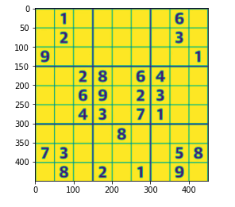
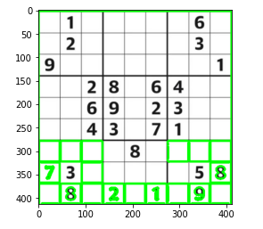
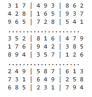

# Sudoku Solver Using CNN

## Overview
This project is a Sudoku Solver that leverages Convolutional Neural Networks (CNNs) to recognize handwritten digits from a Sudoku puzzle image. The model is trained on a dataset of handwritten digits and is used to extract, classify & solve Sudoku puzzles using OpenCV and TensorFlow.

## Dataset
The dataset used for training the model is stored in `Kaggle Dataset/Digits`, consisting of handwritten digit images (0-9) categorized into subdirectories corresponding to their labels.

## Preprocessing
The images are loaded, resized to **32x32** pixels, and converted to grayscale. Then, they undergo histogram equalization for contrast enhancement, followed by normalization to scale pixel values between 0 and 1.

## Model Architecture
A CNN model is used for digit recognition, with two convolutional layers, followed by max pooling, dropout & a fully connected layer.

## Training
The model is compiled using **RMSprop** optimizer and trained for 50 epochs using an ImageDataGenerator for data augmentation.

## Extracting Sudoku Puzzle
The input Sudoku puzzle image is processed using OpenCV to detect and extract the Sudoku grid.

1. Convert image to grayscale.

2. Apply Gaussian Blur and Adaptive Thresholding.

3. Detect Contours to identify the Sudoku grid.

4. Perform Perspective Transform to get a **450x450** pixel Sudoku board.

## Solving the Sudoku
Each Sudoku cell is cropped and classified using the trained CNN model. The extracted digits are then used to form a 9x9 Sudoku grid, which is solved using Backtracking Algorithm.

## Results
The model successfully extracts and solves Sudoku puzzles with high accuracy. However, misclassifications can occur if digit recognition confidence is below 65%.

## Contact

For any questions or collaboration opportunities, feel free to reach out at [hey@njoguevans.me](mailto:hey@njoguevans.me).

